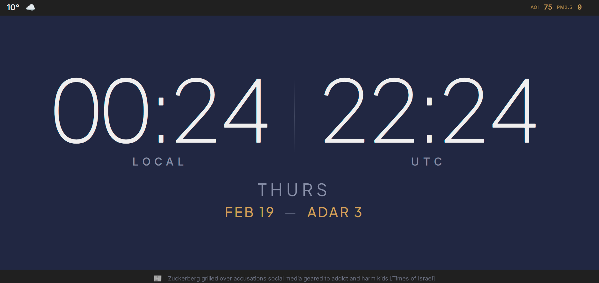

# Pi Time Zone Clock

A Raspberry Pi dashboard clock displaying dual time zones (Jerusalem local + UTC), weather, air quality, Hebrew calendar dates, Pikud HaOref red alerts, and Times of Israel headlines. Automatically switches to Shabbat mode with parasha and candle lighting/havdalah times.



## Features

- **Dual clocks** — Jerusalem local time + UTC, ticking every second
- **Weather** — Current temperature and conditions via OpenWeatherMap
- **Air Quality** — AQI and PM2.5 via IQAir
- **Hebrew Calendar** — Current Hebrew date via Hebcal
- **Red Alerts** — Pikud HaOref missile alerts with pulsing indicator
- **News** — Scrolling headlines from Times of Israel RSS
- **Shabbat Mode** — Auto-detects Shabbat; shows parasha, candle lighting, and havdalah times
- **Settings UI** — Web-based configuration at `/settings`
- **Kiosk ready** — Designed for fullscreen Chromium on a Pi

## Repository Structure

```
├── app/                   # Application code
│   ├── server.js
│   ├── package.json
│   ├── config/
│   ├── services/
│   ├── routes/
│   ├── public/
│   └── deploy/
├── docs/                  # Design & planning
│   └── wireframes/
└── README.md
```

## Quick Start

```bash
# Clone and install
git clone https://github.com/danielrosehill/Pi-Time-Zone-Clock.git
cd Pi-Time-Zone-Clock/app
npm install

# Configure API keys
cp .env.example .env
# Edit .env with your OpenWeatherMap and IQAir keys

# Run
npm start
# Open http://localhost:3000
```

## Configuration

### Environment Variables (`app/.env`)

| Variable | Description | Required |
|----------|-------------|----------|
| `OPENWEATHER_API_KEY` | OpenWeatherMap API key | Yes |
| `IQAIR_API_KEY` | IQAir API key | Yes |
| `PORT` | Server port (default: 3000) | No |
| `LATITUDE` | Location latitude (default: 31.77) | No |
| `LONGITUDE` | Location longitude (default: 35.23) | No |
| `GEONAME_ID` | GeoNames city ID (default: 281184 / Jerusalem) | No |
| `TIMEZONE` | IANA timezone (default: Asia/Jerusalem) | No |

### Settings UI

Visit `http://localhost:3000/settings` to configure:
- Bottom bar mode (auto/news/shabbat)
- Alert polling on/off and interval
- News RSS feed URL
- Time format (12/24hr)
- Location coordinates

## Raspberry Pi Deployment

```bash
# On the Pi:
cd /home/pi/Pi-Time-Zone-Clock/app
sudo bash deploy/setup.sh
```

This installs Node.js, dependencies, creates a systemd service (`pi-clock`), and prepares the kiosk launcher.

```bash
# Start kiosk (fullscreen Chromium)
./deploy/chromium-kiosk.sh

# Service management
sudo systemctl status pi-clock
sudo journalctl -u pi-clock -f
```

## API Endpoints

| Endpoint | Description |
|----------|-------------|
| `GET /api/state` | Full dashboard state (all services) |
| `GET /api/weather` | Current weather |
| `GET /api/airquality` | Air quality data |
| `GET /api/hebrew-date` | Hebrew calendar date |
| `GET /api/shabbat` | Shabbat status and times |
| `GET /api/alerts` | Red alert status |
| `GET /api/news` | News headlines |
| `GET /api/settings` | Current settings |
| `POST /api/settings` | Update settings |

## Architecture

- **Backend**: Node.js + Express. Each data service polls its API on independent intervals and updates a shared in-memory state object.
- **Frontend**: Vanilla HTML/CSS/JS. Client-side clock ticks at 1s; dashboard polls `/api/state` every 10s.
- **No build step** — lightweight enough to run directly on a Pi Zero 2W+.

## Fonts

- **Clock digits**: [Plus Jakarta Sans](https://fonts.google.com/specimen/Plus+Jakarta+Sans) (weight 200, extra-light)
- **UI text**: [Inter](https://fonts.google.com/specimen/Inter) (weights 300–700)
